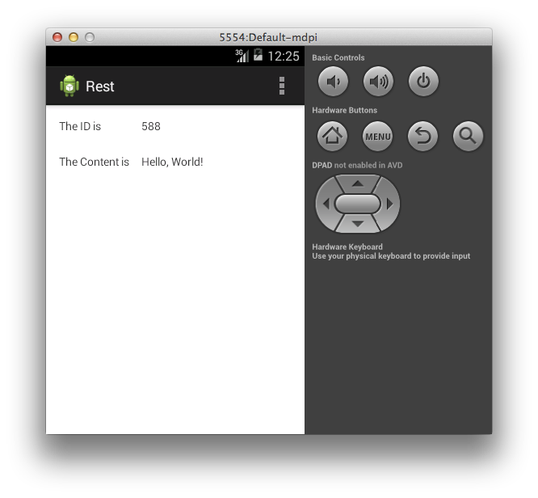

:spring_boot_version: 0.5.0.M6
:spring-android: http://spring.io/projects/spring-android
:Android_Manifest: http://developer.android.com/guide/topics/manifest/manifest-intro.html
:Android_Studio: http://developer.android.com/sdk/installing/studio.html
:toc:
:icons: font
:source-highlighter: prettify
:project_id: gs-consuming-rest-android
This Getting Started guide walks you through the process of building an application that uses {spring-android}[Spring for Android]'s `RestTemplate` to consume a Spring MVC-based link:/understanding/REST[RESTful web service].

== What you will build

You will build an Android client that consumes a Spring-based RESTful web service. Specifically, the client will consume the service created in link:/guides/gs/rest-service[Building a RESTful Web Servce].

The Android client will be accessed through an Android emulator, and will consume the service accepting requests at:

    http://rest-service.guides.spring.io/greeting

The service will respond with a link:/understanding/JSON[JSON] representation of a greeting:

[source,json]
----
{"id":1,"content":"Hello, World!"}
----

The Android client will render the ID and content into a view.

== What you will need

 - About 15 minutes
 - {Android_Studio}[Android Studio]
 - An internet connection

== Create an Android project

Within Android Studio, create a new project. If you prefer, you can use the project in the `initial` folder and skip ahead to <<initial>>. When you are finished, you can compare your code to the `complete` folder and <<run>>. Use "Rest" for the application and module names, and modify the package name to be "org.hello.rest". Enter the location of your choosing for the project and leave all the other options with their default settings.

The next screen presents some options for configuring the app icons. Continue with the default options.

The next screen presents an option to select the type of activity to use. Select "Blank Activity" and continue.

The last screen presents some fields for setting the activity, layout, and fragment names. Again, continue with the default options to finish the project setup.

When the project is created, you will see that several files are added.

To complete this guide, you will edit the following:

 - `Rest/src/main/AndroidManifest.xml`
 - `Rest/src/main/res/values/strings.xml`
 - `Rest/src/main/res/layout/fragment_main.xml`
 - `Rest/src/main/res/menu/main.xml`
 - `Rest/build.gradle`
 - `Rest/src/main/java/org/hello/rest/MainActivity.java`

== Create an Android Manifest

When you created the project, an `AndroidManifest.xml` was also created with a basic implementation. The {Android_Manifest}[Android Manifest] contains all the information required to run an Android application, and it cannot build without one. The manifest also contains any permissions for which the app is requesting of the Android operating system. In this case, the app needs to access the internet to make an HTTP request. 

Add the `INTERNET` permission so the application can access resources over the internet.

`Rest/src/main/AndroidManifest.xml`
[source,xml]
----
include::complete/Rest/src/main/AndroidManifest.xml[]
----

== Create string resources

Text strings can be referenced from the application or from other resource files. This guide uses four text views and a menu item, and each of these UI elements needs a text description. First, remove the `hello_world` and `action_settings` strings. When you created the project, it included these. These are not used for this guide and can be removed. Next, add `id_label`, `id_value`, `content_label`, `content_value` and `action_refresh` strings for each UI widget respectively. 

`Rest/src/main/res/values/strings.xml`
[source,xml]
----
include::complete/Rest/src/main/res/values/strings.xml[]
----

== Create a layout

The layout file is where you define the visual structure for the user interface of your application. When you created the project, Android Studio added a layout fragment. As the name implies, a layout fragment represents a piece of the overall layout. In this case the layout fragment is used to display some text within the main activity. Remove the existing "Hello world!" `TextView` that was added when you created the project. Then modify the layout fragment to include four `TextView` widgets. The ids are used to reference these widgets from the code. Note the use of the string resources for the text of each widget.

`Rest/src/main/res/layout/fragment_main.xml`
[source,xml]
----
include::complete/Rest/src/main/res/layout/fragment_main.xml[]
----
    
The layout includes some information about how to position and size the widgets. Android Studio will display the visual representation of the layout in the preview window:

== Create a menu

The project includes a menu for the main activity with an existing "Settings" option. Remove the "Settings" menu option and add the "refresh" option. Note again the use of the string resource as the title of the menu item.

`Rest/src/main/res/menu/main.xml`
[source,xml]
----
include::complete/Rest/src/main/res/menu/main.xml[]
----
    
Android Studio will display the visual representation of the menu in the preview window:

[[initial]]
== Create a representation class

To model the JSON data received from the RESTful HTTP request, you create a representation class that defines the fields. Navigate to the "org.hello.rest" package in the Project navigator. Select "New..." from the "File" menu.

Select "Java Class"

Add the `id` and `content` member variables and getters.

`Rest/src/main/java/org/hello/rest/Greeting.java`
[source,java]
----
include::complete/Rest/src/main/java/org/hello/rest/Greeting.java[]
----

== Add dependencies

To utilize Spring for Android's RestTemplate within an Android app, you need to add the required Maven dependencies to the Gradle build file. RestTemplate makes use of Jackson, which is a powerful JSON processor for Java.

`Rest/build.gradle`
[source,gradle]
----
include::complete/Rest/build.gradle[]
----

== Create an activity

The Model-View-Controller design pattern (MVC) is used extensively in Android applications. An `Activity` controls the view, which is represented by the layout you already created. When you created the project, a `MainActivity` was also created with a default implementation. Modify the `MainActivity` to make a RESTful HTTP request and update the view. Each modification is explained below.

`Rest/src/main/java/org/hello/rest/MainActivity.java`
[source,java]
----
include::complete/Rest/src/main/java/org/hello/rest/MainActivity.java[]
----

First, add the `HttpRequestTask` private class. This class inherits from `AsyncTask` which is a facility provided by Android for performing potentially, long running activities off of the main UI thread. It is important to do this, because otherwise you can lock the UI, causing a user to believe the app has stopped responding or crashed.

Spring provides a template class called `RestTemplate`. `RestTemplate` makes interacting with most RESTful services a simple process. Within the `doInBackground` method of the `HttpRequestTask` class, `RestTemplate` is used to make an HTTP request and marshal the JSON response to a `Greeting` object. When `doInBackground` returns, the `onPostExecute` method is called, where the text values of the `greetingIdText` and `greetingContentText` widgets are updated with the results of the HTTP request.

Next, add the `onStart` method which calls the `execute` method on `HttpRequestTask`. The `onStart` method is part of the `Activity` lifecycle and is called when the activity starts. The result is that the HTTP request is performed when the app loads.

Lastly, update the `onOptionsItemSelected` method to also execute the HTTP request when the "Refresh" menu item is selected. This allows you to make additional HTTP requests without closing and restarting the app.

Android Studio does not automatically update the imports, however you can change this behavior in the settings. Once enabled it will behave similarly to "Ctrl+Shift+O" in STS or Eclipse. Otherwise, you need to manually update the imports to include the new referenced classes.

[[run]]
== Run the client

You can now run the app from Android Studio. To do this, click the play button (green triangle) in the toolbar of Android Studio. A dialog box will appear asking you to select the device on which to run the app. You must have an Android device or emulator configured in order to run the app. If you have not configured an Android Virtual Device (AVD), then you can select the elipsis to create a new one.

After you select an Android device, the Android Studio will build and deploy the app:

The ID value will increment each time you click the refresh menu button.

== Summary

Congratulations! You have developed a simple REST client using Spring for Android.
